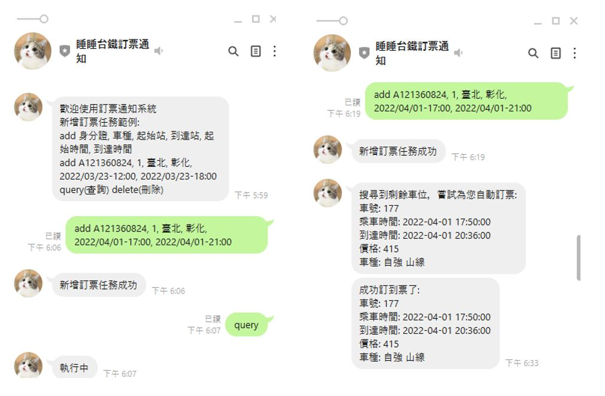

# 台鐵訂票機器人-LineBot
台鐵訂票機器人 由 python django 結合 LineBot開發  

##  功能/指令
* 新增訂票任務  
add 身分證, 車種, 起始站, 到達站, 起始時間, 到達時間
example: add A148451324, 1, 臺北, 彰化, 2022/04/01-17:00, 2022/04/01-21:00

* 收尋訂票任務  
query

* 刪除訂票任務  
delete

* 功能細節  
各個任務30秒搜尋一次剩餘車票，若有車票則嘗試訂票  
因為有驗證碼所以使用2captcha的服務  
一人同時最多訂一張票
一次任務最多持續24小時，時間到了要重新加任務


##  安裝&執行
### 環境變數
新增`.env`檔案或加入環境變數
  
|       環境變數       | 說明 |
|:--------------------|:-----------------------------|
| DJANGO_SECRET_KEY    | django SECRET                 |
| LINE_ACCESS_TOKEN    | Linebot Channel access toke   |
| LINE_SECRET          | Linebot Channel secret        |
| DEBUG                | 0 or 1                        |
| IS_HEROKU            | 1 or 1                        |
| CAPTCHA_KEY          | 2captcha token                |

### 安裝  
安裝套件  
``` 
pip install -r requirements.txt 
```
初始化資料庫  
``` 
python manage.py makemigrations api
python manage.py migrate api
python manage.py loaddata api/trainCrawler/initial_station_data.json
```

### 執行  
```
python manage.py runserver
```

##  目前問題、待開發項目
* query 功能只有回傳任務狀態(執行中、沒有任務)  
之後要儲存訂票資訊
* heroku問題   
因為是使用heroku，若要使用celery，需要使用2個dynos，會算2倍的時間  
免費服務的時間不夠，會無法持續運行  
所以任務改用thread實作，目前未實作queue排程之類的，服務一多應該會炸開XD    
* 驗證碼辨識功能  
訂票有使用google recaptcha V2  
目前使用2captcha去解析，但要付費，錢用完就沒了  
看有沒有機會解這問題
* line push message問題  
line push message 1個月只有500則免費，之後考慮換到telegram
* add指令還沒有做lock  
輸入太快可能會記錄到2筆任務，之後再用redis來做掉...
